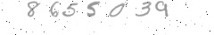
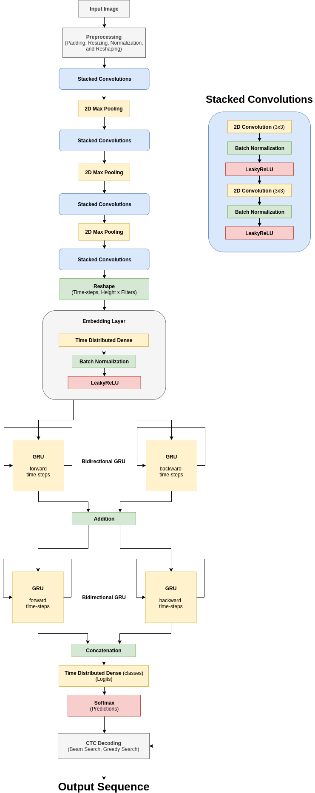
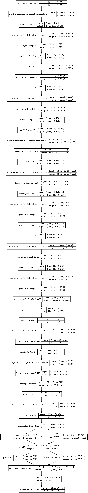

# Handwritten Digits Recognition

Sequences of handwritten digits are created synthetically and then the model is trained on these images.

Examples:
* 
* 

A convolutional-recurrent neural network is trained using ctc loss. The recurrent part of the network is a bidirectional GRU (Gated Recurrent Unit) which is a variant of the well-known LSTM (Long Short Tem Memory) with no forget gate. Experimentation shows that GRU performs as well as LSTM and takes less time to train. The network architecture used is similar to the architectures proposed in the following papers:

* [Baoguang Shi, Xiang Bai and Cong Yao (2015), An End-to-End Trainable Neural Network for Image-based Sequence Recognition and Its Application to Scene Text Recognition.](https://arxiv.org/pdf/1507.05717.pdf)
* [Hui Li and Chunhua Shen (2016), Reading Car License Plates Using Deep Convolutional Neural Networks and LSTMs.](https://arxiv.org/pdf/1601.05610.pdf)

For more on ctc loss, ctc greedy decoding, and ctc beam search decoding the reader can consult these resources:

* Paper: [Alex Graves, Santiago Fernandez, Faustino Gomez, and Jurgen Schmidhuber (2006), Connectionist Temporal Classification: Labelling Unsegmented Sequence Data with Recurrent Neural Networks.](https://www.cs.toronto.edu/~graves/icml_2006.pdf)
* Paper: [Andrew L. Maas, Ziang Xie, Dan Jurafsky, and Andrew Y. Ng (2015), Lexicon-Free Conversational Speech Recognition with Neural Networks.](http://deeplearning.stanford.edu/lexfree/lexfree.pdf)
* Article: [Awni Hannun, Sequence Modeling With CTC.](https://distill.pub/2017/ctc/)
* Article: [Connectionist Temporal Classification.](https://machinelearning-blog.com/2018/09/05/753/)
* Article: [Harald Scheidl, An Intuitive Explanation of Connectionist Temporal Classification.](https://towardsdatascience.com/intuitively-understanding-connectionist-temporal-classification-3797e43a86c)
* Article: [Harald Scheidl, Beam Search Decoding in CTC-trained Neural Networks.](https://towardsdatascience.com/beam-search-decoding-in-ctc-trained-neural-networks-5a889a3d85a7?)

## Try it out

First, you need to make sure that you have python 3 installed on your machine, then install the requirements using the following commands:

```bash
cd src
python3 -m pip install --user -r requirements.txt
```

Also, the Graphviz dependency must be installed from https://graphviz.gitlab.io/download.

To generate the images and train the model, run the following commands in the terminal:

```bash
cd src
python3 -m digits.sequence_generator
python3 -m model.icr digits
```

## Current Model Architecture



